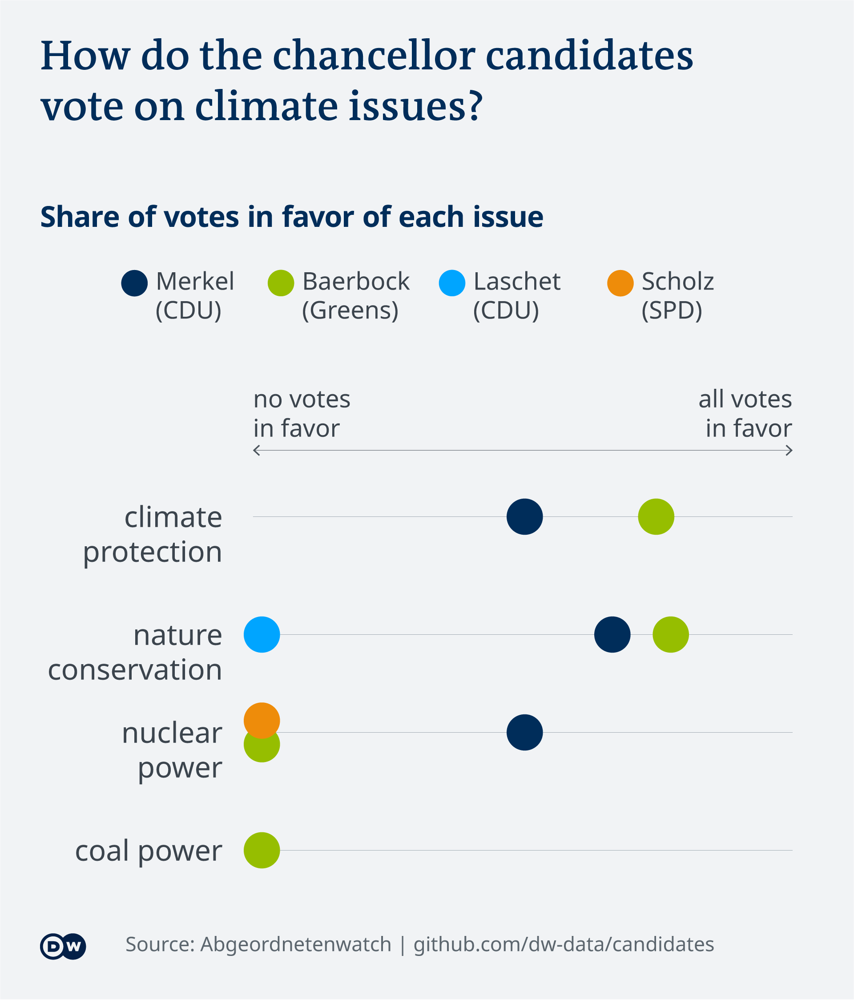
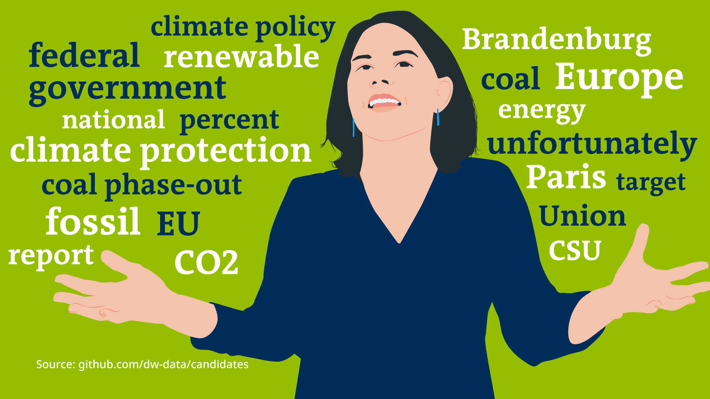
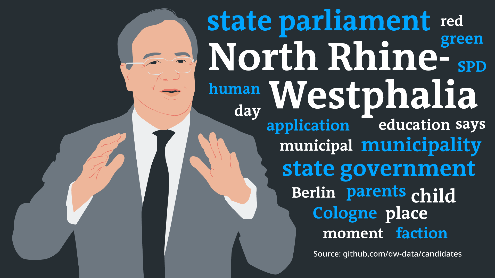
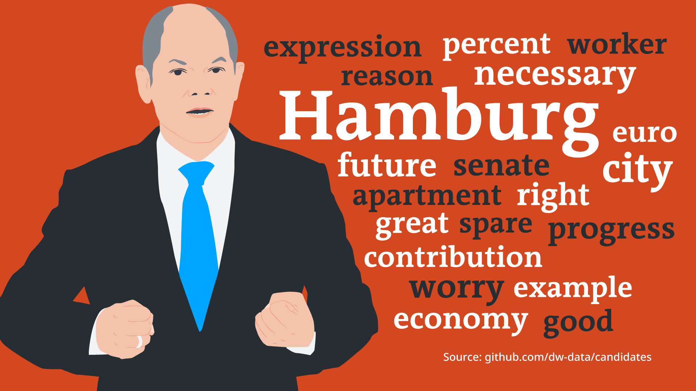

# Chancellor candidate comparison

Merkel is one of the most prominent figures in international politics.
Her successor, whoever they may be, will have the power to shape global
politics just as much. So let’s look at the candidates’ track records.
We analyzed:

  - which words each candidate uses more often than others in
    parliamentary speeches
  - how each candidate voted on various issues in parliament, and how
    these votes compare to Merkel’s

*In this repository, you will find the methodology, data and code behind
the story that came out of this analysis.*

**Read the full article on DW:** [English](https://www.dw.com/a-58261469) |
[German](https://www.dw.com/a-58261954)

**Story by:** [Kira
Schacht](https://www.twitter.com/daten_drang)

# Files

| Name                 | Content                                                                           |
| -------------------- | --------------------------------------------------------------------------------- |
| `btw_candidates.Rmd` | The main R markdown script. Run in RStudio to reproduce this analysis.            |
| `data.RData`         | The R Data file containing the imported datasets. Use if csv import doesn’t work. |
| `data/...`           | Data files                                                                        |

# Data sources

Data on voting behaviour is taken from the [Abgeordnetenwatch.de
API](https://www.abgeordnetenwatch.de/api).

Parliamentary speeches of the candidates are downloaded
    from:

1.  <https://www.bundestag.de/services/opendata>
2.  <https://www.landtag.nrw.de/home/dokumente_und_recherche/parlamentsdatenbank/>
3.  <https://www.buergerschaft-hh.de/parldok/formalkriterien>

# Analysis

Here is a step-by-step-explanation of the code we used in this analysis.
You can explore it yourself by opening `btw_candidates.Rmd` in RStudio.

# 1\. Similarity in voting behaviour

Data from [Abgeordnetenwatch.de
API](https://www.abgeordnetenwatch.de/api) extracted in early June 2021.
The latest votes included are from 19th May 2021.

## 1.1 Get voting data

### get list of votes by poll and candidate

Number of polls by candidate:

| candidate |   n |
| :-------- | --: |
| baerbock  | 297 |
| laschet   |  38 |
| merkel    | 443 |
| scholz    |  88 |

Share of polls by candidate and response:

|          | abstain |   no | no\_show |  yes |
| -------- | ------: | ---: | -------: | ---: |
| baerbock |    0.12 | 0.31 |     0.14 | 0.43 |
| laschet  |    0.03 | 0.66 |     0.11 | 0.21 |
| merkel   |    0.00 | 0.06 |     0.65 | 0.29 |
| scholz   |    0.05 | 0.14 |     0.22 | 0.60 |

### get details on polls

See `btw_candidates.Rmd` for code.

## 1.2 Identify topics that are relevant to DW readers

From the list of voting topics, those relevant to DW audiences are
identified manually:

2 coders label each topic independently as either a “DW topic” or a
“non-DW topic”. They then discuss and resolve any discrepancies.

The list of topics identified as DW topics in this way is:

  - 17 Entwicklungspolitik (development policy)
  - 20 Energie (energy)
  - 43 Menschenrechte (human rights)
  - 48 Naturschutz (nature conservation)
  - 35 Frauen (women)
  - 4 Europapolitik und Europäische Union (European policy and European
    Union)
  - 9 Umwelt (environment)
  - 11 Außenwirtschaft (foreign trade)
  - 13 Verteidigung (defense)
  - 21 Außenpolitik und internationale Beziehungen (foreign policy and
    international relations)
  - 25 Ausländerpolitik, Zuwanderung (immigration policy)
  - 33 Humanitäre Hilfe (humanitarian
    aid)

### how often has each candidate voted/abstained per topic?

| dw\_topic |   n |
| :-------- | --: |
| FALSE     | 289 |
| TRUE      | 281 |

Around half of all polls fall into DW topics.

All votes that concern DW topics are then labeled manually to identify
which specific issues they concern and what stance on these issues a
“yes” vote on the poll conveys.

## 1.3 Manual labeling of issues

The manual content analysis was conducted as follows:

### generating keywords / issues related to the polls

3 coders read the polls labeled `dw_topic == TRUE` and created a list of
10-20 key issues the polls relate to. The 3 lists are then compared,
discussed and consolidated into one list.

The 15 key issues identified in this way
    are:

| group        | code | label                |
| :----------- | ---: | :------------------- |
| Militär      |    1 | Bundeswehreinsatz    |
| Militär      |    2 | Mittelmeereinsatz    |
| Umwelt       |    3 | Atomenergie          |
| Umwelt       |    4 | Erneuerbare Energien |
| Umwelt       |    5 | Emissionsausgleich   |
| Umwelt       |    6 | Kohleenergie         |
| Umwelt       |    7 | Klimaschutz          |
| Umwelt       |    8 | Naturschutz          |
| Umwelt       |    9 | Gentechnik           |
| Außenpolitik |   10 | EU-Kooperation       |
| Außenpolitik |   11 | EU-Finanzhilfen      |
| Migration    |   12 | Flüchtlingspolitik   |
| Migration    |   13 | Zuwanderung          |
| Außenpolitik |   14 | Handelsabkommen      |
| Militär      |   15 | Rüstungsexporte      |
| Andere       | \-99 | Nicht zutreffend     |
| Anderes      | \-90 | Zu komplex           |

Polls could also be labeled as concerning neither of the 15 key issues
(`-99` = Nicht zutreffend) or as too complex to discern whether a
“yes”-vote can be counted as a stance pro or contra any of the
issues (`-90` = Zu komplex).

### label polls

2 coders independently assigned each poll to up to 3 of the key issued
identified in the previous step. For each poll and issue, they also note
whether a “yes”-vote in the poll indicates a stance for or against the
issue. The labels are then compared and discrepancies discussed and
consolidated.

    ## 
    ## -99 -90   1   2   3   4   5   6   7   8   9  10  11  12  13  14  15 
    ##  25   9 145  30  11   4   3   3  12  14   5  16  15  20  23   2   1

9 polls were labeled as too complex to include (`-90`), 25 didn’t have
anything to do with the selected key topics (`-99`). Those are excluded
from the analysis.

### get stance on issues from voting result

Column `vote = {"yes", "no", "abstain", "no_show"}` records how the
candidate voted (Source: Abgeordetenwatch API). Column `pro.contra =
{0,1}` records whether a “yes” vote means the candidate voted for (`1`)
or against (`0`) the labeled key issue (Source: manual labeling).

`stance` then records the stance indicated by the vote (TRUE if the
candidate supports the issue with this vote, FALSE if they don’t) as
follows:

  - `vote = yes` AND `pro.contra = 1` –\> `TRUE`
  - `vote = yes` AND `pro.contra = 0` –\> `FALSE`
  - `vote = no` AND `pro.contra = 1` –\> `FALSE`
  - `vote = no` AND `pro.contra = 0` –\> `TRUE`
  - `vote = abstain` OR `vote = no_show` –\> N/A

To allow a solid basis of comparison between candidates, stances are
included in the following analysis if:

  - at least two different candidates (incl. Merkel) have participated
    in at least one vote on the issue and
  - the individual candidate has participated in more than one vote on
    it

For each issue, the candidate’s stance is calculated as the share of
votes that supported the
issue.

### create approval plot for each issue group

# 2\. Speeches

The candidates have given speeches in 3 different parliaments. To get
data on all speeched, we proceeded as follows:

**Bundestag (Annalena Baerbock ab 2013, Olaf Scholz 2005-2011):**

1.  Download XML data from <https://www.bundestag.de/services/opendata>
2.  Filter for candidate’s speeches

**Landtag NRW (Armin Laschet):**

1.  Find a list of speeches in the parliamentary databases and download
    it as a HTML document.

<!-- end list -->

  - URL:
    “<https://www.landtag.nrw.de/home/dokumente_und_recherche/parlamentsdatenbank/Suchergebnisse_Ladok.html?dokart=PLENARPROTOKOLL&redner=LASCHET%2C+ARMIN*&view=detail&allOnPage=true&wp=17>”
  - Go through the pages for wp=14 through wp=17
  - Save each as a HTML file

<!-- end list -->

3.  Convert the PDF documents to text and save
4.  Filter for candidate’s speeches

**Hamburgische Bürgerschaft (Olaf Scholz):**

1.  Find a list of speeches in the parliamentary databases and download
    it as a HTML document.

<!-- end list -->

  - URL: “Formalkriterien”-search under
    “<https://www.buergerschaft-hh.de/parldok/formalkriterien>”
  - For Wahlperiode 19 and 20, choose “Urheber (Personen): Scholz, Olaf”
    and tick “Reden”.
  - Save each as a HTML file

<!-- end list -->

3.  Convert the PDF documents to text and save
4.  Filter for candidate’s speeches

## 2.1 Download PDF files

### make list of PDF links

See `btw_candidates.Rmd` for code.

### convert PDFs to text and save

See `btw_candidates.Rmd` for code.

## 2.2 Download XML Files

The parliamentary protocols from the federal parliament are available as XML files [here](https://www.bundestag.de/services/opendata).

See `btw_candidates.Rmd` for code.

## 2.3 Read documents and filter for candidate’s speeches

See `btw_candidates.Rmd` for code.

### Bundestag parliamentary period 16 to 18 & NRW parliament

See `btw_candidates.Rmd` for code.

### Hamburg parliament

See `btw_candidates.Rmd` for code.

### Bundestag parliamentary period 19

See `btw_candidates.Rmd` for code.

## 2.4 Bind all files together and clean

See `btw_candidates.Rmd` for code.

## 2.5 Text mining

To analyze which words are most characteristic for each candidate, we
use a smoothed odds ratio:

We separated their speeches into individual words, removing stopwords
(filler words that carry no meaning) and grammar (using the [Snowball
stemming
algorithm](https://snowballstem.org/algorithms/german/stemmer.html) for
German). We then calculated the relative frequency of each word in the
candidates’ speeches and compared it to its relative frequency in their
competitor’s speeches. This ratio, with a small constant added to avoid
division by zero, is called the “odds ratio” and describes how much more
likely a candidate is to use a given word than their competitors are.

If the odds ratio is bigger than 1, the candidate is more likely to use
the word than their competitors are, if it is between 0 and 1, they are
less likely to use it. If the value for “change” is 2, for example, the
candidate is twice as likely to use the word “change” than their
competitors. If the value is 0.5, they are hald as likely to use it.

For more info on odds ratios, as well as other measures of
“characteristic” words, see here:

*Monroe, B., Colaresi, M., & Quinn, K. (2017). Fightin’ Words: Lexical
Feature Selection and Evaluation for Identifying the Content of
Political Conflict. Political Analysis, 16(4), 372-403.
<doi:10.1093/pan/mpn018>* [Link](http://languagelog.ldc.upenn.edu/myl/Monroe.pdf)

See `btw_candidates.Rmd` for the
code.

### Make Word clouds

